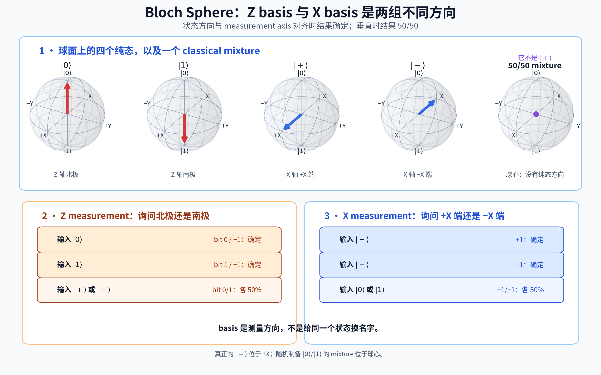
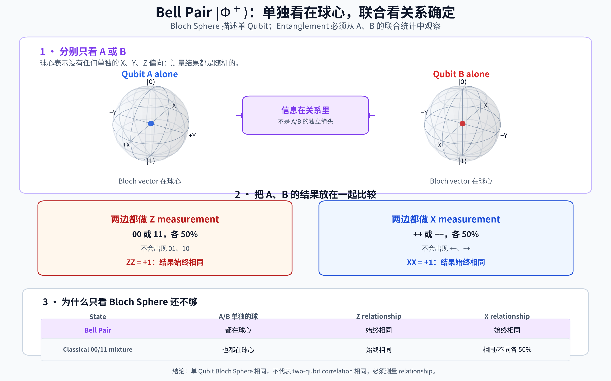
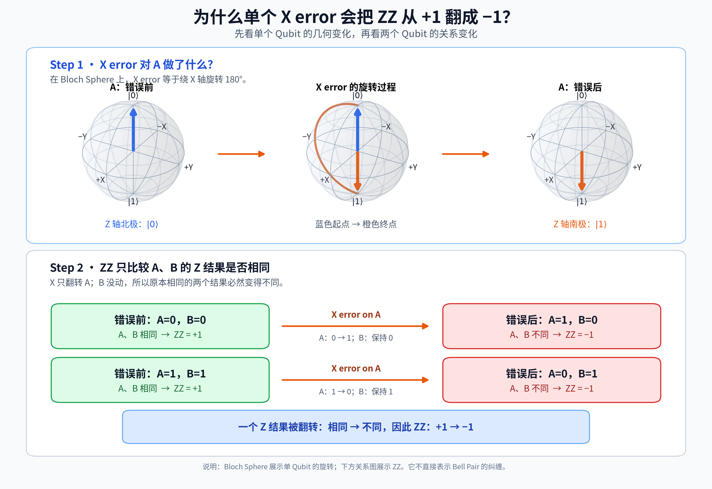
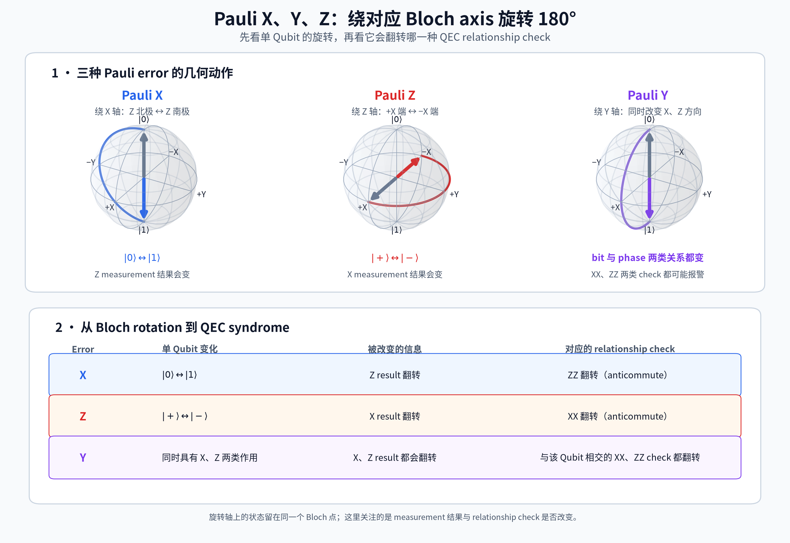

# 阶段 1 补充：从真实问题重新理解最小量子知识

## 这份补充解决什么问题

[阶段 1 主笔记](README.md)整理了已经建立起来的知识主线。这份补充不重复追求简洁，而是保留学习过程中真正卡住过的地方。

它不是聊天记录。每个问题都按照下面的顺序重新组织：

1. 当时困惑的具体位置是什么。
2. 先看准备、操作和观察结果。
3. 再给出当前需要保留的准确说法。
4. 如果理论原因尚未真正理解，就明确标为“尚未作为前置知识掌握”。

读完后，应该能够独立排查这几类混淆：

- 是状态、操作、measurement basis，还是 readout result？
- 看到 50/50 时，究竟是一个确定的量子状态、普通随机 mixture，还是 Bell Pair 的单边结果？
- `ZZ/XX` 是两个单独结果，还是一个联合关系结果？
- check 翻转能说明发生了什么，又不能说明什么？

## 1. 先把符号和输出说清楚

### 问题：`|+⟩` 外面的反引号是什么

Markdown 文档里经常写：

```text
`|+⟩`
```

两边的反引号只是把内容显示成代码样式。它不是量子力学符号。

这次表格里出现孤立的反引号，不是量子符号写错了。原因是 ket 开头的竖线 `|` 同时也是 Markdown 表格的分栏符。Typora 能容忍这种写法，但更严格的预览器会把它误当成新的一列，结果只留下一个反引号。本文档在表格中改用等价的 HTML 字符写法，最终显示仍然是 `|0⟩`，但不会再被当成分栏符。

真正的量子符号只有：

```text
|+⟩
```

它读作 ket plus。当前可以把 `|...⟩` 看成“这是一个量子状态标签”：

- `|0⟩`：Z 方向的 `0` 状态。
- `|1⟩`：Z 方向的 `1` 状态。
- `|+⟩`：X 方向的 `+` 状态。
- `|−⟩`：X 方向的 `−` 状态。

`+` 和 `−` 在这里是状态名称，不是正概率和负概率。

### 问题：measurement 为什么有时输出 `0/1`，有时输出 `+1/-1`

Readout bit 是测量硬件最终交给经典软件的 `0/1`。论文为了方便描述关系，经常把同一个结果改写成 `+1/-1`。这是同一个测量结果的两种编码方式。

以 Z measurement 为例：

| 量子结果 | Readout bit | 论文常用的有符号结果 |
| --- | --- | --- |
| <code>&#124;0⟩</code> | `0` | `+1` |
| <code>&#124;1⟩</code> | `1` | `-1` |

论文把 `+1/-1` 称为 measurement eigenvalue。现阶段不需要学习这个词的代数定义，只把它理解成“方便计算关系的有符号结果”。

例如两个 Z 结果相乘：

| A 的结果 | B 的结果 | 相乘结果 | 对应 readout | 关系 |
| --- | --- | --- | --- | --- |
| `+1` | `+1` | `+1` | `00` | 相同 |
| `-1` | `-1` | `+1` | `11` | 相同 |
| `+1` | `-1` | `-1` | `01` | 不同 |
| `-1` | `+1` | `-1` | `10` | 不同 |

所以 `ZZ = +1` 表示相同，`ZZ = -1` 表示不同。

X measurement 通常也用 `+1/-1` 表示：

| 状态 | X measurement |
| --- | --- |
| <code>&#124;+⟩</code> | `+1` |
| <code>&#124;−⟩</code> | `-1` |

真实硬件接口也可能统一返回 bit。DSL 或 Compiler 必须明确 bit 与有符号结果之间的约定，不能靠猜。

### 问题：`basis` 到底是什么

Basis 不是给同一个状态换一个名字，而是选择 measurement 要问哪一组问题：

```text
Z basis：你更符合 |0⟩ 还是 |1⟩？
X basis：你更符合 |+⟩ 还是 |−⟩？
```

同一个状态面对不同问题，可以表现得完全不同。

例如 `|0⟩`：

- Z measurement：一定得到 bit `0`，也就是 `+1`。
- X measurement：`+1/-1` 各 50%。

例如 `|+⟩`：

- X measurement：一定得到 `+1`。
- Z measurement：bit `0/1` 各 50%。

因此，每次说“测量结果是什么”之前，必须先说 measurement basis。

### 问题：两边都使用 X measurement，结果就会自动相关吗

不会。Measurement basis 只说明怎样问每个 Qubit，不会凭空制造 A、B 之间的关系。

例如分别准备：

```text
A = |+⟩
B = |0⟩
```

两边都做 X measurement：

```text
A：一定得到 +1
B：+1/-1 各 50%
```

B 的结果与 A 无关，因此 `XX` 可能是 `+1`，也可能是 `-1`。

同样，如果说“A 做 X measurement，B 做 Z measurement”，仍然不能只凭 basis 猜结果。还必须先知道 A、B 分别准备成了什么状态，以及它们是否通过某个操作建立了关系。

Bell Pair 的特殊之处不是“两边用了同一种 measurement”，而是之前的 preparation 和 H+CNOT 操作已经建立了联合关系。

## 2. 怎样直观看 `|+⟩` 和 `|−⟩`

### 问题：为什么 `|+⟩` 和 `|−⟩` 做 Z measurement 都是 50/50，它们却不是同一个状态

因为一个量子状态不是“只做一种 measurement 时的统计结果”。更准确的操作性说法是：

> 一个状态决定了面对不同 measurement basis 时会表现出什么结果。

对比三种准备方式：

| 准备方式 | Z measurement | X measurement |
| --- | --- | --- |
| 每次准备 <code>&#124;+⟩</code> | `0/1` 各 50% | 一定 `+1` |
| 每次准备 <code>&#124;−⟩</code> | `0/1` 各 50% | 一定 `-1` |
| 抛硬币准备 <code>&#124;0⟩</code> 或 <code>&#124;1⟩</code> | `0/1` 各 50% | `+1/-1` 各 50% |

三者的 Z measurement 统计相同，但 X measurement 不同。只看 Z 方向的信息不完整。

`|+⟩` 和 `|−⟩` 相对于 Z basis 都是 superposition state。这里的 superposition 可以先理解成：Qubit 并不是已经偷偷固定成 `0` 或 `1`，只是我们还不知道；换一个 measurement basis 后，它会表现出普通随机 `|0⟩/|1⟩` mixture 没有的确定结果。

这就像只知道一个物体在南北方向上的投影，不能据此断定它在东西方向上的位置。

### 用 Bloch Sphere 看四个方向



Bloch Sphere 是单 Qubit 状态方向的地图，不是一个真实的小球：

- 北极 `+Z` 是 `|0⟩`。
- 南极 `−Z` 是 `|1⟩`。
- `+X` 端是 `|+⟩`。
- `−X` 端是 `|−⟩`。

图中把具有明确箭头方向的状态称为 pure state（纯态）。普通随机 mixture 没有这样的固定方向。

观察规则：

- 状态正好指向 measurement axis 的一端：结果确定。
- 状态与 measurement axis 垂直：两种结果各 50%。
- 普通机器随机准备 `|0⟩/|1⟩` 时，长期统计没有固定方向，画在球心。

所以：

```text
|+⟩：在 +X 端，不在球心
随机 |0⟩/|1⟩ mixture：在球心，不是 |+⟩
```

两者都能产生 Z 方向的 50/50，但原因和其他 measurement 结果不同。

### 问题：能否用矩阵表示 basis

可以。当前只把矩阵当成坐标表，不要求计算。

传统的竖排矩阵很依赖空格、字体和行高。为了让 Codex、Typora 和 GitHub 得到一致结果，这里改用程序员更熟悉的一行写法：

```text
col(a, b) = 上面是 a、下面是 b 的二行一列向量
```

四个状态可以写成：

| 状态 | 列向量的一行写法 |
| --- | --- |
| <code>&#124;0⟩</code> | `col(1, 0)` |
| <code>&#124;1⟩</code> | `col(0, 1)` |
| <code>&#124;+⟩</code> | `(1/√2) × col(1, 1)` |
| <code>&#124;−⟩</code> | `(1/√2) × col(1, -1)` |

Basis matrix 的做法，是把同一组 basis 的两个列向量并排放在一起。用二维数组表示就是：

```text
Z basis matrix：B_Z = [[1, 0], [0, 1]]
X basis matrix：B_X = (1/√2) × [[1, 1], [1, -1]]
```

读 `[[a, b], [c, d]]` 时：

- `[a, b]` 是矩阵第一行；
- `[c, d]` 是矩阵第二行。

因此，`B_X` 的第一列是 `(1/√2) × col(1, 1)`，也就是 `|+⟩`；第二列是 `(1/√2) × col(1, -1)`，也就是 `|−⟩`。

这里最容易误解的是 `|−⟩` 中的 `-1`：

- 它不是 measurement 的 `-1` 结果。
- 它不是负概率。
- 它是数学坐标中的符号。
- 这个符号不会改变 Z measurement 的 50/50，却会影响换到 X basis 后的确定结果。

更深的数学解释会用到 amplitude 和 relative phase。它们尚未作为本阶段的必需前置知识掌握，后面会单独说明目前掌握到哪里。

## 3. H gate 怎样连接 Z basis 与 X basis

### 先把 H 当成一个有明确输入输出的操作

```text
H|0⟩ = |+⟩
H|1⟩ = |−⟩
H|+⟩ = |0⟩
H|−⟩ = |1⟩
```

H 执行两次会回到原状态：

```text
|0⟩ → H → |+⟩ → H → |0⟩
|1⟩ → H → |−⟩ → H → |1⟩
```

### 问题：`|+⟩` 经过 H 后做 Z measurement 会怎样

操作顺序是：

```text
输入 |+⟩
   ↓ H
变成 |0⟩
   ↓ Z measurement
readout bit = 0，有符号结果 = +1
```

### 问题：`|1⟩` 经过 H 后做 Z measurement 会怎样

```text
输入 |1⟩
   ↓ H
变成 |−⟩
   ↓ Z measurement
readout bit 0/1 各 50%
```

这正好等价于直接对原来的 `|1⟩` 做 X measurement：结果 `+1/-1` 各 50%。

因此，在抽象层上可以写成：

```text
X measurement = H + Z measurement
```

这里描述的是可观察效果。具体硬件可以用不同脉冲和 readout 流程实现同样的抽象操作。

### 问题：为什么 H 的矩阵会出现“相加”和“相减”

之前如果直接写：

```text
新的 0 坐标 = (原来的 0 坐标 + 原来的 1 坐标) / √2
新的 1 坐标 = (原来的 0 坐标 - 原来的 1 坐标) / √2
```

对没有 amplitude 基础的人，这并不是解释，只是换了一种更难懂的说法。

本阶段已经验证的理解是 H 的输入输出表，以及它怎样把 X measurement 转成 Z readout。至于矩阵为什么这样组合坐标，需要先单独建立下面四个概念：

1. probability 是重复实验中可观察到的频率；
2. amplitude 是量子模型为不同可能结果保存的数学数值，不是直接观察到的概率；
3. relative phase 是这些数值之间的相对符号或方向关系；
4. interference 是多个数学贡献到达同一个输出时，先按符号组合，再产生最终概率。

仅仅列出这四个定义，还不足以说明它们为什么成立。因此当前不把“相加、相减、抵消”当成已经理解的知识，也不依赖它们继续学习 QEC。

如果后续需要从矩阵层实现或验证量子线路，可以另开一个小节，只用单 Qubit 实验从 probability 开始重新建立这套模型。

## 4. CNOT 到底怎样工作

CNOT 有两个角色：

- A 是 control Qubit。
- B 是 target Qubit。

规则只有一条：

```text
A = 0：B 不变
A = 1：B 翻转
```

完整真值表：

| 输入 AB | A 是否为 1 | B 是否翻转 | 输出 AB |
| --- | --- | --- | --- |
| `00` | 否 | 不翻转 | `00` |
| `01` | 否 | 不翻转 | `01` |
| `10` | 是 | `0 → 1` | `11` |
| `11` | 是 | `1 → 0` | `10` |

### 两个容易混淆的例子

输入 `11`：

```text
A = 1，所以 B 翻转
B：1 → 0
输出：10
```

输入 `10`：

```text
A = 1，所以 B 翻转
B：0 → 1
输出：11
```

Control Qubit A 本身不会因为这条规则从 `1` 变成 `0`。发生翻转的是 target Qubit B。

## 5. Bell Pair 为什么不是普通的 `00/11` 随机机器

Entanglement（纠缠）描述的是一种 two-qubit 联合状态：它在不同 measurement basis 下表现出的整套关系，不能由“机器随机准备两个普通的单 Qubit 状态”完整复制。Bell Pair 是最简单的 entangled state。

### Bell Pair 的制备流程

从 `|00⟩` 开始：

```text
准备 A=|0⟩、B=|0⟩
          ↓
        H(A)
          ↓
      CNOT(A → B)
          ↓
     Bell Pair |Φ+⟩
```

本阶段把这段线路当成一个已经由量子理论和实验验证过的操作契约。我们关注它的可观察输出，不使用尚未掌握的“量子路径相加”作为解释前提。

### 分别只看 A 或 B

对 A 或 B 单独做 measurement：

| Measurement | A 单独看 | B 单独看 |
| --- | --- | --- |
| Z | `0/1` 各 50% | `0/1` 各 50% |
| X | `+1/-1` 各 50% | `+1/-1` 各 50% |

所以单独看任何一边，都没有确定答案。

### 把 A、B 放在同一次实验中比较

| 两边使用的 measurement | 只会出现 | 不会出现 | 关系 |
| --- | --- | --- | --- |
| 都用 Z | `00`、`11`，各 50% | `01`、`10` | `ZZ = +1` |
| 都用 X | `++`、`−−`，各 50% | `+−`、`−+` | `XX = +1` |



### 问题：B 的 X measurement 不是仍然 50/50 吗，为什么又说它和 A 相同

需要区分两个问题。

问题一：还没有看 A 时，B 自己会得到什么？

```text
B：+1/-1 各 50%
```

问题二：同一次实验中已经把 A、B 的结果放在一起比较时，它们有什么关系？

```text
如果 A = +1，那么 B = +1
如果 A = -1，那么 B = -1
```

所以每一边都随机，但两边不是独立随机。

可以用两种抽奖机区分：

```text
独立随机：A、B 各自抽签，四种组合都可能出现
相关随机：机器随机选 ++ 或 −−，单边仍是 50/50，但两边始终相同
```

这个类比只解释“单边随机与联合相关可以同时成立”，不是 Bell entanglement 的完整经典模型。

### 问题：`++` 的概率是不是 25%

对于 Bell Pair `|Φ+⟩`，不是。

因为 X measurement 只会出现两个联合结果：

```text
++：50%
−−：50%
```

`+−` 和 `−+` 的概率为 0。

只有当 A、B 的 X 结果彼此独立且各自 50/50 时，四种组合才各占 25%。

### 普通机器随机准备 `00` 或 `11`

这台机器的 Z measurement 与 Bell Pair 相同：

```text
00：50%
11：50%
```

但每次实际准备的 `|0⟩` 或 `|1⟩` 在 X measurement 下都是 50/50。两边没有 Bell Pair 的 X 关系，因此：

```text
++：25%
+−：25%
−+：25%
−−：25%
```

于是：

| 准备方式 | `ZZ` | `XX` |
| --- | --- | --- |
| Bell Pair | 一定是 `+1` | 一定是 `+1` |
| 普通 `00/11` mixture | 一定是 `+1` | `+1/-1` 各 50% |

### 问题：只看到 `ZZ = +1` 能证明是 Bell Pair 吗

不能。它只说明 Z 关系始终相同。普通随机 `00/11` 也能做到。

在理想的 two-qubit 模型中，同时满足：

```text
ZZ = +1
XX = +1
```

可以唯一指定 Bell state `|Φ+⟩`。但真实实验需要重复很多次 measurement，统计这些关系是否真的接近 100%，不能只根据单次结果下结论。

### 问题：只测量 A 能证明 Bell Pair 吗

不能。

单独看 A：

- Z result 随机；
- X result 也随机。

普通随机 mixture 也能产生相同的单边统计。Bell Pair 的特征在 A、B 的联合关系中，必须把两边结果一起看。

## 6. `ZZ` 和 `XX` 是什么

### 先用“分别测量再比较”理解结果含义

```text
ZZ = A 的 Z 结果 × B 的 Z 结果
XX = A 的 X 结果 × B 的 X 结果
```

因为每个有符号结果只有 `+1/-1`：

```text
两边相同 → 乘积 +1
两边不同 → 乘积 -1
```

这是一种帮助理解符号的计算模型。

### 但真正的联合 measurement 不是分别读取再相乘

分别测量 A、B 会输出：

```text
A = 0
B = 0
```

联合 `ZZ` measurement 只输出：

```text
A、B 的 Z 关系相同，也就是 +1
```

它不会继续告诉我们具体是 `00` 还是 `11`。

| 操作 | 暴露的信息 |
| --- | --- |
| 分别测量 A、B | A 的值、B 的值、两者关系 |
| 联合测量 `ZZ` | 只有两者关系 |

### 问题：联合 measurement 也叫 measurement，为什么它没有同样破坏量子态

更准确的说法不是“联合 measurement 完全不影响状态”。Measurement 都可能改变状态。区别在于它区分到多细。

分别测量 A、B：

```text
从 {00, 11} 中继续选出具体的 00 或 11
```

联合测量 `ZZ`：

```text
只区分 {00, 11} 这一组，还是 {01, 10} 这一组
```

如果被保护的信息正好存在于同一组内部，联合 measurement 就没有把它继续拆开。因此 QEC 可以得到关系线索，同时避免读取逻辑内容。

以后在 surface code 中，通常会让 ancilla Qubit 与多个 data Qubits 发生操作，最后只测量 ancilla。Ancilla 是临时帮助提取关系的 Qubit，不直接保存要保护的逻辑信息。

### 对 DSL 最重要的语义区别

下面两段不能被默认当成等价操作：

```text
measure_z(A)
measure_z(B)
classical_compare(A, B)
```

```text
measure_product(ZZ, [A, B])
```

前者读取两个 data Qubits，后者只读取联合关系。Compiler 是否能够把联合测量翻译（lower）成某组硬件指令，要由目标硬件的执行模型决定。

## 7. 为什么 X error 会让 `ZZ` 从 `+1` 变成 `-1`

### 先看单 Qubit 的局部变化

X error 会交换：

```text
|0⟩ ↔ |1⟩
```

Bloch Sphere 上，它相当于绕 X 轴旋转 180°，把 Z 北极转到 Z 南极，或把南极转到北极。

### 再看两个 Qubit 的关系

假设原本 `ZZ = +1`，因此 Z 结果相同。

如果只有 A 发生 X error：

```text
00 → 10
11 → 01
```

如果只有 B 发生 X error：

```text
00 → 01
11 → 10
```

不管翻转 A 还是 B，结果都从“相同”变成“不同”：

```text
ZZ：+1 → -1
```



这张图分成两部分，因为 Bloch Sphere 只能展示单 Qubit 的局部旋转，不能独自展示 two-qubit relationship。

### 问题：能否从 `ZZ = -1` 判断 A 还是 B 出错

不能。

下面两种情况都会产生同一个结果：

```text
A 发生 X error，B 不变
A 不变，B 发生 X error
```

`ZZ = -1` 只说明 A、B 的 Z 关系变了，没有包含“到底是哪一边”的信息。

### 问题：如果 A、B 都发生 X error 呢

```text
00 → 11
11 → 00
```

两边都翻转后仍然相同，因此：

```text
ZZ 仍然是 +1
```

这说明没有 alarm 不等于没有 error。一个 check 只能观察某种关系是否被改变。

## 8. 为什么 Z error 会让 `XX` 翻转

Z error 不改变 Z measurement：

```text
|0⟩ 的 Z result 不变
|1⟩ 的 Z result 不变
```

所以它不会翻转 `ZZ`。

但 Z error 会交换 X 方向的状态：

```text
|+⟩ ↔ |−⟩
```

假设原来 A、B 的 X 结果相同：

```text
++ 或 −−
```

如果只有 B 发生 Z error，B 的 X 答案翻转：

```text
++ → +−
−− → −+
```

于是从“相同”变成“不同”：

```text
XX：+1 → -1
```

如果 A、B 同时发生 Z error，两边的 X 答案都翻转，关系仍然相同，所以 `XX` 仍然是 `+1`。

## 9. Y error 是否需要关注

需要，但 surface code 的错误分析通常把它拆成 X 和 Z 两类效果来处理。

在当前关心的 relationship check 上：

```text
Y error = 同时具有 X error 和 Z error 的检查效果
```

所以单个 Y error 会：

- 像 X error 一样翻转 `ZZ`；
- 像 Z error 一样翻转 `XX`。

| 单个 error | `ZZ` | `XX` |
| --- | --- | --- |
| X | 翻转 | 不变 |
| Z | 不变 | 翻转 |
| Y | 翻转 | 翻转 |



因此，“surface code 主要关注 X 和 Z”不等于“忽略 Y”。Y 会同时在两类 syndrome 中留下线索。

## 10. `commute` 和 `anticommute` 当前需要理解到哪里

不用先做矩阵乘法，可以直接看 check result：

- error 后 check 不变：两者 commute。
- error 后 check 翻转：两者 anticommute。

例如：

```text
X error 与 ZZ anticommute，因为它翻转 ZZ
X error 与 XX commute，因为它不翻转 XX
Z error 与 XX anticommute，因为它翻转 XX
Z error 与 ZZ commute，因为它不翻转 ZZ
```

这里有一个重要限定：上面的表说的是 error 在一个 Qubit 上与 check 相交一次。如果同一种翻转作用在 check 覆盖的两个 Qubits 上发生两次，两个翻转可能互相抵消，联合 check 又保持不变。

## 11. Syndrome 为什么是线索，不是答案

### 一个 check 不足以定位 error

如果只有一个 `ZZ(A,B)` 从 `+1` 变成 `-1`：

```text
可能是 A 发生 X error
也可能是 B 发生 X error
```

### 多个相邻 check 可以缩小范围

假设有三个 Qubits A、B、C，并检查两条关系：

```text
check 1：ZZ(A,B)
check 2：ZZ(B,C)
```

原本两条都是 `+1`。如果只发生一个 X error：

| Error 位置 | `ZZ(A,B)` | `ZZ(B,C)` |
| --- | --- | --- |
| A | `-1` | `+1` |
| B | `-1` | `-1` |
| C | `+1` | `-1` |

如果两条关系同时报警，B 是最直接的解释，因为 B 同时参与两条 check。

但仍然只能说“最可能”：

- 也可能同时发生了多个 error；
- measurement 本身以后也可能出错；
- 更大的 code 中，不同的多个相连 error 组合可能产生相同 syndrome。这样的相连错误组合以后会称为 error chain。

Syndrome 是整组 check results 形成的模式。Decoder 会结合模式、时间历史，以及“哪些 error 更常见”的统计假设。这组统计假设称为 noise model。Decoder 推断的是最可能的解释，而不是读取一个绝对正确的错误位置报告。

## 12. 常见问题的短答案

### 只知道 Z measurement 是 50/50，能判断 `|+⟩` 还是 `|−⟩` 吗

不能。还需要 X measurement。`|+⟩` 得到 `+1`，`|−⟩` 得到 `-1`。

### `|+⟩` 经过 H 后是什么

`|0⟩`。随后做 Z measurement，readout bit 是 `0`，有符号结果是 `+1`。

### `|1⟩` 经过 H 后是什么

`|−⟩`。随后做 Z measurement，bit `0/1` 各 50%。

### Bell Pair 中 B 的单独结果随机，为什么又说 B 跟 A 相同

单独看 B 时随机；同一次实验中把 A、B 放在一起比较时，它们相关。随机描述单边，相关描述联合结果，两句话不冲突。

### Bell Pair 的 `++` 概率是 25% 吗

不是。`++` 和 `−−` 各 50%，另外两种组合不出现。

### `ZZ = +1` 能证明没有 error 吗

不能。两个 X error 可以让 `ZZ` 保持 `+1`，Z error 也不会改变 `ZZ`。

### `ZZ = -1` 能确定是哪一个 Qubit 出错吗

不能。单个 check 只能确定关系变了。

### 为什么 QEC 不分别测量 data Qubits 再用软件比较

因为这样会读取每个 data Qubit 的具体信息。QEC 需要只输出关系的联合 measurement。

### Surface code 是否只需要关心 X 和 Z，不管 Y

不是。Y 同时具有 X 和 Z 两类检查效果，通常会同时影响 X-type 和 Z-type syndrome。

## 13. 当前已经掌握与尚未宣称掌握的边界

### 已经掌握的操作性知识

- 能根据 preparation、gate 和 measurement basis 判断可观察结果。
- 能用 Bloch Sphere 区分 `|0⟩`、`|1⟩`、`|+⟩`、`|−⟩` 和普通 mixture。
- 能使用 H 和 CNOT 的输入输出规则。
- 能区分 Bell Pair 与普通随机 `00/11`。
- 能解释 `ZZ/XX` 的 `+1/-1` 关系含义。
- 能解释单个 X、Z、Y error 怎样翻转 checks。
- 能说明 syndrome 为什么不能唯一定位 error。
- 能区分分别读取 data Qubits 与联合 relationship measurement。

### 尚未作为前置知识掌握的理论细节

- amplitude 为什么不是 probability；
- relative phase 的完整数学定义；
- H 为什么让某些数学贡献相加、另一些相减；
- Bell Pair 在 X basis 下保持相关的 amplitude 推导；
- Pauli matrix 的计算、把多个 Qubit 操作组合起来的 tensor product 规则，以及用一组固定关系描述量子状态的 stabilizer formalism。

这些内容没有被假装成已经理解。当前的操作性模型足以进入阶段 2，从 repetition code 建立 QEC 的纠错闭环。

如果未来的 DSL、模拟器或 Compiler 工作要求直接计算量子状态坐标、gate matrix，或者使用表格数据结构追踪 stabilizer 关系，再回来建立这条数学支线。届时必须从 probability 与 amplitude 的区别开始，不能直接跳到“量子路径相加或抵消”。

## 14. 一段可以独立复述的话

> Basis 是 measurement 的提问方向，不是给同一个状态换名字。`|+⟩` 和 `|−⟩` 虽然做 Z measurement 都是 50/50，但做 X measurement 时答案相反。Bell Pair 的每个 Qubit 单独看是随机的，但 A、B 的 `ZZ` 和 `XX` 联合关系可以确定；普通随机 `00/11` 只能复制 Z 关系，不能复制 X 关系。QEC 不分别读取 data Qubits，而是联合测量关系。单个 X error 翻转 `ZZ`，单个 Z error 翻转 `XX`，Y error 同时翻转两类 check。Check result 是 syndrome 线索，不是唯一错误位置；Decoder 必须组合多个 check 和多轮记录来推断。
