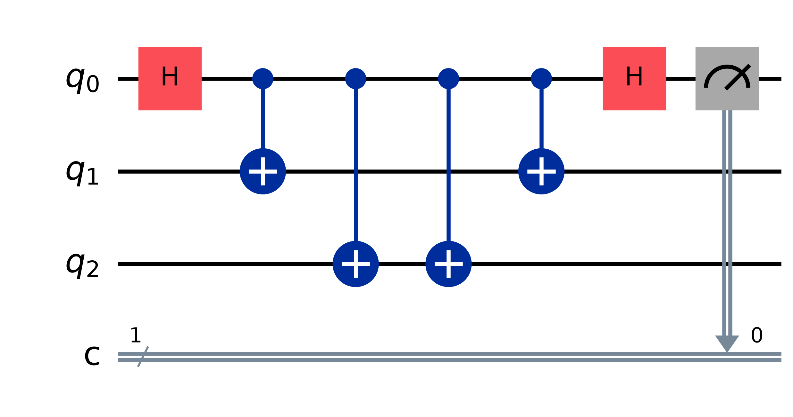
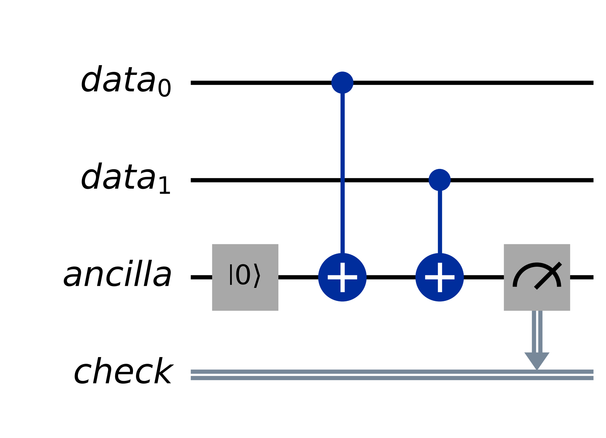

# 阶段 2：从一般纠错理解 QEC

## 本阶段要解决的问题

这一阶段从经典 repetition code 出发，建立量子纠错最基本的闭环：

```text
错误发生
  → stabilizer measurement 留下 syndrome
  → 多轮 syndrome 形成 detection events
  → decoder 推断最可能的错误
  → 更新 Pauli frame
  → 正确解释 logical 结果
```

读完后，应该能够解释：

1. 为什么冗余可以保护信息，但不能保证永不出错。
2. 为什么 QEC 不能直接读取每个 data Qubit。
3. ancilla 怎样只带出 Qubit 之间的关系。
4. syndrome、detection event 和 decoder 分别负责什么。
5. correction 为什么不一定要执行物理 gate。
6. code distance 和 threshold 为什么决定保护能力。

这一阶段最重要的结论是：

> QEC 不会看到错误的真实过程。它反复测量不会泄露 logical 信息的固定关系，再让 decoder 根据有限线索推断最可能的错误，并通过 Pauli frame 正确解释后续结果。

## 1. 从经典 repetition code 开始

如果只保存一个经典 bit：

```text
1 → 发生翻转 → 0
```

读取 `0` 时，无法知道它原本是不是 `1`。最简单的保护办法是保存三份：

| Logical bit | 三个 physical bits |
| --- | --- |
| `0` | `000` |
| `1` | `111` |

这里真正想保护的是一个 logical bit，实际承担存储的是三个 physical bits。

如果只发生一个翻转：

```text
111 → 101
```

多数表决仍然得到 logical `1`。如果两个 bit 翻转：

```text
111 → 100
```

多数表决会错误地得到 logical `0`。

因此要区分：

- **Physical error**：某个实际载体发生了错误。
- **Logical error**：最终被保护的信息发生了错误。

一个 code 可以容忍一些 physical errors，但它不能保证 logical error 永远不会发生。

## 2. Parity check、syndrome 和 decoder

除了多数表决，还可以只比较相邻 bit 是否相同：

```text
第一个 check：比较 bit 1 和 bit 2
第二个 check：比较 bit 2 和 bit 3
```

这里约定：

```text
相同 → 0
不同 → 1
```

| Physical bits | 两次 parity checks | 单错误假设下的推断 |
| --- | --- | --- |
| `000` 或 `111` | `00` | 没发现错误 |
| `100` 或 `011` | `10` | bit 1 出错 |
| `010` 或 `101` | `11` | bit 2 出错 |
| `001` 或 `110` | `01` | bit 3 出错 |

这种只检查相同还是不同的操作叫 **parity check（奇偶校验）**。一组 check 的完整结果叫 **syndrome（错误综合）**。

Syndrome 是观察结果，不是错误位置报告。例如 syndrome `01` 直接说明的只有：

```text
bit 1 和 bit 2 相同
bit 2 和 bit 3 不同
```

在原始信息为 `111` 时，下面两种错误都能产生 syndrome `01`：

```text
Q3 单独出错：111 → 110
Q1、Q2 同时出错：111 → 001
```

根据 syndrome 和错误概率推断最可能解释的程序叫 **decoder（解码器）**。Decoder 不是在还原错误录像，它只是在有限线索下作出推断。

## 3. 为什么不能直接读取 data Qubits

经典 bit 可以读取后再比较。Qubit 不行，因为 measurement 可能改变正在保护的量子信息。

三 Qubit bit-flip code 使用下面的编码关系：

```text
logical |0⟩ₗ  →  physical |000⟩
logical |1⟩ₗ  →  physical |111⟩
```

Logical Qubit 不是额外的第四个 Qubit。它是一份分散在三个 physical Qubits 联合状态中的量子信息。

Logical `|+⟩ₗ` 是普通 `|+⟩` 经过编码后的状态。可以这样准备：

```text
Q1：|+⟩
Q2：|0⟩
Q3：|0⟩
```

接着执行 `CNOT(Q1 → Q2)` 和 `CNOT(Q1 → Q3)`。如果最后分别做 Z measurement，三个结果只会是 `000` 或 `111`。它不是提前随机选好了其中一个，而是仍然保留着原来 `|+⟩` 的 X-basis 信息。

下面的 Qiskit 电路先编码，再按反向顺序撤销编码，最后对恢复出的 Q1 做 X measurement。图中最后的 `H + Z readout` 等价于 X measurement。



Qiskit 从 `0` 开始编号，所以图里的 `q0/q1/q2` 分别对应正文中的 `Q1/Q2/Q3`。先用确定的 Z-basis 输入核对四个 CNOT：

```text
Q1 为 0：000 → 000 → 000
Q1 为 1：100 → 111 → 100
```

第一组 CNOT 把 Q1 的 Z-basis 答案关联到 Q2、Q3，第二组按反向顺序把关联撤销。这里列出两种确定输入只是为了核对 gate 的动作，不表示 `|+⟩` 在 measurement 前已经偷偷选好了 `0` 或 `1`。

没有中途 measurement 时：

```text
|+00⟩
  → 编码
logical |+⟩ₗ
  → 撤销编码
|+00⟩
```

Q1 恢复为 `|+⟩`，因此 X measurement 确定得到 `+1`。

如果编码后分别测量三个 data Qubits 的 Z 信息，就会读到 `000` 或 `111`。测量后的状态变成确定的 `|000⟩` 或 `|111⟩`，原来的 logical `|+⟩ₗ` 已被改成 logical `|0⟩ₗ` 或 logical `|1⟩ₗ`。撤销编码后，Q1 是确定的 `|0⟩` 或 `|1⟩`，再做 X measurement 只会得到 50/50。

所以 QEC 不能用下面的方法检查错误：

```text
分别读取每个 data Qubit
  → 在经典软件中比较
```

它需要让物理操作本身只带出关系，不带出每个 data Qubit 的具体答案。

## 4. Ancilla 怎样只带出关系

只测量两个 data Qubits 的 `ZZ` 关系，可以加入一个 **ancilla Qubit（辅助 Qubit）**：

1. 把 ancilla 准备成 `|0⟩`。
2. 执行 `CNOT(data₀ → ancilla)`。
3. 执行 `CNOT(data₁ → ancilla)`。
4. 只测量 ancilla。



Ancilla 的结果如下：

| 两个 data Qubits 的 Z 结果 | Ancilla 的变化 | Readout | `ZZ` |
| --- | --- | --- | --- |
| `00` | 翻转 0 次 | `0` | `+1` |
| `01` | 翻转 1 次 | `1` | `-1` |
| `10` | 翻转 1 次 | `1` | `-1` |
| `11` | 翻转 2 次，回到 0 | `0` | `+1` |

测到 ancilla 为 `0` 时，只知道两个 Z-basis 答案相同，无法区分 `00` 和 `11`。因此进入经典世界的是一条关系，而不是 logical `0/1`。

联合 measurement 不是“完全不改变量子态”。它会确定被测关系是 `+1` 还是 `-1`。关键在于：合法的 logical `0` 和 logical `1` 具有相同的固定关系，所以这个 measurement 不会区分它们。

## 5. Stabilizer 和 syndrome

在三 Qubit bit-flip code 中，合法编码状态都满足：

```text
Z₁Z₂ = +1
Z₂Z₃ = +1
```

这种用于定义和检查合法编码状态的固定关系叫 **stabilizer（稳定子）**。测量它的过程叫 **stabilizer measurement** 或 **stabilizer check**。

在“最多一个 X error”的前提下：

| Error | `Z₁Z₂` | `Z₂Z₃` | Syndrome |
| --- | --- | --- | --- |
| 无错误 | `+1` | `+1` | `(+1,+1)` |
| Q1 发生 X | `-1` | `+1` | `(-1,+1)` |
| Q2 发生 X | `-1` | `-1` | `(-1,-1)` |
| Q3 发生 X | `+1` | `-1` | `(+1,-1)` |

如果取消单错误假设，syndrome 就不再唯一。例如：

```text
Q3 单独发生 X
```

和：

```text
Q1、Q2 同时发生 X
```

都会产生 syndrome `(+1,-1)`。

## 6. Syndrome 和 detection event 不是一回事

同一组 stabilizer 会被反复测量。一次完整测量叫一个 **round（轮次）**。

假设一个 stabilizer 的连续结果是：

```text
轮次：       1    2    3    4    5
syndrome：  +1   +1   -1   -1   -1
```

第 3、4、5 轮的 syndrome 都是 `-1`，但这不代表发生了三次错误。可能只是在第 2→3 轮之间发生了一次错误，之后关系一直保持为 `-1`。

**Detection event（检测事件）**表示相邻两轮的测量结果发生了变化：

```text
轮次边界：  1→2   2→3   3→4   4→5
是否变化：   否     是     否     否
```

Detection event 按“哪个 check 在哪个轮次边界发生变化”计数，不按 physical error 的数量计数。一个位于中间的 data-Qubit error 可以同时翻转两个相邻 checks，因此产生两个 detection events。

Measurement 本身也可能出错。例如真实关系一直为 `+1`，但第 3 轮错误地读成 `-1`：

```text
真实关系：  +1   +1   +1   +1   +1
测量记录：  +1   +1   -1   +1   +1
```

这一次 measurement error 会产生两个 detection events：

```text
第 2→3 轮：+1 → -1
第 3→4 轮：-1 → +1
```

因此，一个 detection event 只说明相邻记录不同。Decoder 必须结合空间中的多个 checks、多轮历史和 noise model，判断更可能是 data error、measurement error，还是多个错误的组合。

## 7. Decoder 猜错怎样形成 logical error

假设最初保存 logical `0`：

```text
|000⟩
```

Q1、Q2 同时发生 X error：

```text
000 → 110
```

Syndrome 是 `(+1,-1)`。如果 decoder 假设只有一个错误，就会推断 Q3 出错。再对 Q3 执行 X：

```text
110 → 111
```

此时 syndrome 恢复为 `(+1,+1)`，但 logical `0` 已经变成 logical `1`。

这说明：

> 所有 stabilizer checks 都恢复正常，不代表 logical 信息一定正确。

三个 physical Qubits 全部发生 X：

```text
X₁X₂X₃：000 ↔ 111
```

它会在两个合法 logical 状态之间切换，因此相当于一次 logical X error。

## 8. Correction 和 Pauli frame

Decoder 推断出一个 Pauli correction 后，不一定要立即执行物理 gate。

假设 logical `1` 的 physical 状态原本是 `111`，Q3 发生 X error：

```text
111 → 110
```

Decoder 推断 Q3 需要 X correction。可以真的执行 X：

```text
110 → 111
```

也可以不碰 Qubit，只在经典软件中记录：

```text
Q3 上有一个尚未物理执行的 X correction
```

这份记录叫 **Pauli frame（泡利帧）**。Physical 状态仍然是 `110`。如果最终硬件 Z readout 是 `110`，软件根据 frame 把第三位反向解释，得到 `111`。

Pauli frame 的作用是避免不必要的物理 correction gate，并让后续 operation 和 measurement 得到正确解释。它不会让 physical error 消失，也不能弥补 decoder 的错误推断。

## 9. X、Z、Y error 需要不同关系检查

三 Qubit bit-flip code 中的 `ZZ` checks 只能发现会翻转 Z-basis 答案的错误：

```text
X error：|0⟩ ↔ |1⟩
```

Z error 不改变 Z-basis 的 `0/1`，而是翻转 X-basis 的答案：

```text
Z error：|+⟩ ↔ |−⟩
```

因此，`ZZ` checks 看不到 Z error。要保护 X-basis 的 `+/-` 信息，可以构造另一种 repetition code：

```text
+ → +++
- → ---
```

并检查：

```text
X₁X₂
X₂X₃
```

三类 Pauli error 的可观察效果是：

| Error | Z-basis 答案 | X-basis 答案 | 会翻转的 check 类型 |
| --- | --- | --- | --- |
| X | 翻转 | 不翻转 | `ZZ` |
| Z | 不翻转 | 翻转 | `XX` |
| Y | 翻转 | 翻转 | `ZZ` 和 `XX` |

所以常用的记法是：

```text
Z-type stabilizer 检测 X 类错误
X-type stabilizer 检测 Z 类错误
Y error 同时影响两类 syndrome
```

这里讨论的是两种不同的三 Qubit repetition code。三个 Qubit 不足以同时完整保护任意 Qubit 的 X、Z 和 Y error。Surface code 会使用一组彼此兼容的 X-type 和 Z-type stabilizers 同时提取两类错误线索。

## 10. Code distance、logical error 和 threshold

先只考虑 repetition code 对 X error 的保护。

```text
logical 0：000
logical 1：111
```

把一个合法状态直接变成另一个合法状态，需要三个 X errors：

```text
000 → 111
```

所以它的 **X-error distance** 是：

```text
dₓ = 3
```

Distance 为 3 不代表可以纠正三个错误。它只能保证纠正一个 X error。对于奇数 distance 的 repetition code：

| X-error distance | 能保证纠正的 X errors |
| --- | --- |
| `3` | 1 个 |
| `5` | 2 个 |
| `7` | 3 个 |

能保证纠正的数量是 `(d-1)/2`。这里 `d` 表示 distance。

当前 code 发现不了单个 Z error，因此不能把它当作完整的 distance-3 quantum code。完整 quantum code 的 distance 要考虑形成无法检测的 logical error 所需的最短 Pauli-error 组合。

还要区分两个错误率：

- **Physical error rate**：physical Qubit、gate 或 measurement 出错的概率。
- **Logical error rate**：经过编码、syndrome measurement 和 decoding 后，logical 信息仍然出错的概率。

Distance 增大时，形成 logical error 通常需要更多 physical errors，但同时也需要更多 Qubits 和 operations。只有 physical error 足够低时，增加 distance 才会持续降低 logical error rate。

这个分界条件叫 **error threshold（错误阈值）**：

- 低于 threshold：增加 distance 通常会降低 logical error rate。
- 高于 threshold：增加资源不保证更可靠。

Threshold 不是只由 code 名字决定的固定数字。它还取决于 noise model、gate 与 measurement error、stabilizer circuit、decoder 和 code variant。

## 11. 完整纠错闭环

下面用一个理想化场景串起阶段 2。

系统正在保护 logical `1`：

```text
physical 状态：111
Pauli frame：空
```

第 5 轮测得：

```text
Z₁Z₂ = +1
Z₂Z₃ = +1
```

第 5 轮之后，Q2 发生 X error：

```text
111 → 101
```

第 6 轮测得：

```text
Z₁Z₂ = -1
Z₂Z₃ = -1
```

两个 checks 都在第 5→6 轮发生变化，因此产生两个 detection events。Decoder 在单错误假设下推断 Q2 发生 X error，但这不是绝对事实；例如 Q1、Q3 同时发生 X 也会产生相同 syndrome。

系统不执行物理 X，只在 Pauli frame 中记录 Q2 correction。Physical 状态仍然是 `101`。最终硬件 Z readout 也是 `101`，软件根据 frame 把第二位反向解释，得到 `111`，因此 logical 结果仍是 `1`。

完整过程可以复述为：

> Q2 发生 X error 后，两个相邻 stabilizer 的 syndrome 从 `+1` 变成 `-1`，在同一轮次边界产生两个 detection events。Decoder 根据 syndrome 和单错误假设推断 Q2 最可能出错，于是记录 Q2 的 X correction 到 Pauli frame。Physical 状态仍为 `101`，但最终 readout 结合 frame 后被解释为 `111`，恢复正确的 logical `1`。

## 12. 容易混淆的地方

### Syndrome 不是错误位置

同一个 syndrome 可能由不同 physical-error 组合产生。Decoder 输出的是推断，不是事实。

### Detection event 不按 physical error 数量计数

它按“哪个 check 在哪个轮次边界发生变化”计数。一个 physical error 可以产生多个 detection events，一次 measurement error 也可以在相邻两个时间边界留下两个 detection events。

### `+1` syndrome 不证明没有错误

多个 errors 可能互相抵消 check 的变化，也可能已经形成合法但错误的 logical 状态。

### Pauli frame 没有修复 physical 状态

它保存的是待解释的 Pauli correction。Physical error 仍然存在，后续结果要结合 frame 读取。

### 联合 measurement 不是分别读取后比较

Ancilla 只带出关系结果。分别读取 data Qubits 会泄露 logical 信息并改变被保护状态。

### 当前三 Qubit code 不是完整的 distance-3 quantum code

它对单个 Z error 没有保护能力。完整 QEC 必须同时处理 X、Z 和 Y error。

## 13. 工程师视角

这一阶段已经出现 QEC 控制系统必须区分的几类数据：

```text
Stabilizer 定义
  → 每轮 measurement readouts
  → 与上一轮比较得到 detection events
  → decoder 推断
  → Pauli frame updates
  → 结合 frame 解释 logical measurement
```

它们不能混成一个“error result”：

- Measurement readout 是硬件直接返回的数据。
- Syndrome 是一轮 check 的关系结果。
- Detection event 是相邻轮次的变化。
- Decoder output 是基于 noise model 的推断。
- Pauli frame 是经典侧持续维护的解释状态。

这一阶段只建立平台无关语义，不规定 DSL、Compiler 或硬件 ISA 怎样表达它们。

## 阶段结论

可以用下面这段话概括阶段 2：

> Repetition code 把一份 logical 信息分散到多个 physical carriers。QEC 不能直接读取 data Qubits，而是通过 ancilla 反复测量不会区分 logical `0/1` 的 stabilizer 关系。Syndrome 描述一轮关系结果，detection event 描述相邻轮次的变化。Decoder 根据这些线索和 noise model 推断最可能的 Pauli error，再通过 physical correction 或 Pauli frame 处理。Distance 决定形成 logical error 所需的最短错误规模；只有 physical error rate 低于 threshold 时，增加 distance 才能持续降低 logical error rate。

## 验收记录

本阶段已经能够独立说明：

- 三 Qubit repetition code 怎样纠正一个 X error。
- 为什么 syndrome 不是错误位置报告。
- 为什么不能分别测量 data Qubits 后再做经典比较。
- ancilla 怎样只提取 `ZZ` relationship。
- stabilizer、syndrome 和 detection event 的区别。
- 为什么一个 Q2 X error 会在同一轮次边界产生两个 detection events。
- decoder 猜错后怎样形成 syndrome 正常但 logical 信息错误的状态。
- physical correction 和 Pauli frame 的区别。
- `ZZ`、`XX` checks 分别检测哪类 Pauli error。
- code distance、logical error rate 和 threshold 的基本关系。
- “错误发生 → syndrome 变化 → decoder 推断 → Pauli frame 更新”的完整闭环。

## 自测问题

1. Syndrome `(+1,-1)` 为什么不能证明 Q3 单独发生 X error？
2. 为什么 logical `|+⟩ₗ` 不能通过分别测量三个 data Qubits 来检查？
3. Ancilla 如何在不区分 `00/11` 的情况下测量 `ZZ`？
4. 连续 syndrome 为 `+1,+1,-1,+1,+1` 时，有几个 detection events？为什么一次 measurement error 就可能造成这个记录？
5. 为什么 `ZZ` checks 看不到 Z error？什么类型的 checks 能看到？
6. Pauli frame 更新后，physical state 是否已经恢复？
7. 为什么 distance 变大不保证 logical error rate 一定下降？

## 下一阶段

阶段 3 将开始学习论文中的 surface-code patch 游戏，理解 tile、patch、boundary、initialization、measurement 和 deformation。阶段 4 再把这些游戏规则逐项映射到本阶段建立的 stabilizer measurement、syndrome history、detection event 和 decoder。
