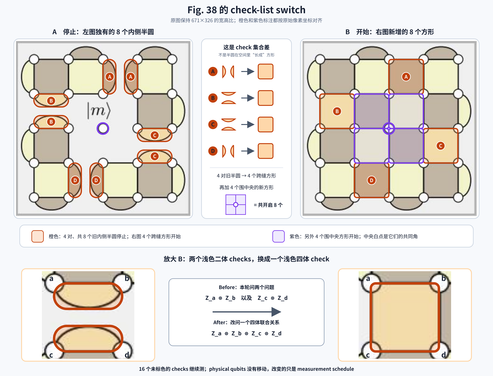

# 延后参考：Fig. 38 的 check switch

这页保存 state-injection 学习中已经澄清的 check-replacement 细节，供阶段 4、5 回看。

它不是阶段 3 的过关要求。当前主线只需阅读 [state injection 的最小理解](state-injection.md)。

## 1. 图中究竟停了什么、开了什么

Fig. 38 的 physical data qubits 没有移动。切换的是 measurement schedule：

```text
16 个左右两图共有的 checks → 继续测量
8 个朝向内部空隙的二体 checks → 停止测量
4 个跨越旧空隙的四体 checks → 开始测量
4 个围绕中央 m 的四体 checks → 开始测量
```



8 个旧半圆不是逐个“长成”8 个方形。它们两两形成 4 对：

```text
每对旧内侧半圆
    ↓
1 个跨缝四体 check

另外加入：
4 个围绕中央 m 的四体 checks
```

因此右图仍然每轮测 24 个 checks。

## 2. 一个局部的 operator replacement

考虑两个旧 Z checks：

```text
A = Z_a⊗Z_b，旧结果为 s₁
B = Z_c⊗Z_d，旧结果为 s₂
```

新中央 X check 可以抽象写成：

```text
C = X_b⊗X_d⊗X_e⊗X_m
```

它分别与 `A、B` 共享一个 physical qubit 上的 X/Z factor。测量 `C` 后，`A、B` 的单独 quantum answers 不再保持确定。

但是旧 checks 的乘积为：

```text
A×B = Z_a⊗Z_b⊗Z_c⊗Z_d
```

`A×B` 与 `C` 在 `b、d` 上有两次 X/Z overlap，因此能够与 `C` 同时保持确定。`A×B` 正是新的跨缝四体 Z check。

局部关系因此从：

```text
切换前：A、B
```

变为：

```text
切换后：A×B、C
```

关系数量仍然是两个，但其中一个新关系包含中央 `m`。

## 3. “保留旧结果”有两层含义

切换后：

- `s₁、s₂` 作为过去的 measurement records，仍保存在经典控制器中。
- 当前量子状态不再保证 `A=s₁、B=s₂`。
- 当前继续保证的是 `A×B=s₁×s₂`。

所以新的 bridge check 有一个来自旧 history 的初始 reference：

```text
new bridge result = s₁×s₂
```

如果新 measurement 与这个关系不符，decoder 才需要结合周围和时间上的其他结果判断是否发生了 data/measurement fault。

## 4. Measurement 不会偷偷执行 Pauli operation

不能把上述 incompatibility 解释成：

> 测量中央 X check 时，机器对共享 qubits 执行了 X flip。

Pauli X operation 与 X measurement 是两种不同动作：

```text
X operation：|0⟩ ↔ |1⟩

X measurement：返回 +1/-1，并建立相应的 X answer
```

“一个 X check 与一个 Z check 有奇数次 overlap”在 measurement 层面的含义是：

> 测量其中一个后，另一个原本确定的 answer 会变得不再确定。

用 operator 作用后是否改变符号来计算 odd/even overlap，只是一种 compatibility 检查方法，不是在描述 measurement circuit 实际施加了一次该 operator。

## 5. 两-qubit 验证

开始准备：

```text
|00⟩
```

此时：

```text
Z₁=+1
Z₂=+1
Z₁⊗Z₂=+1
```

现在测得：

```text
X₁⊗X₂=+1
```

状态变成：

```text
(|00⟩+|11⟩)/√2
```

此后：

```text
Z₁：不再确定
Z₂：不再确定
Z₁⊗Z₂：仍确定为 +1
```

这个例子展示的不是 X measurement 执行了 bit flip，而是：两个单独 Z constraints 被一个 Z-product constraint 和一个 X-product constraint 取代。

## 6. 后续阶段要补上的内容

阶段 4、5 再严格回答：

- 为什么 odd overlap 对应 anticommutation；
- 哪些 check outcomes 是独立 generators；
- switch 前后的 syndrome history 怎样连接；
- measurement ancilla 与 gate order 如何实现 face check；
- decoder 怎样区分 data fault 与 measurement fault。
