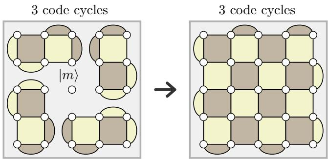
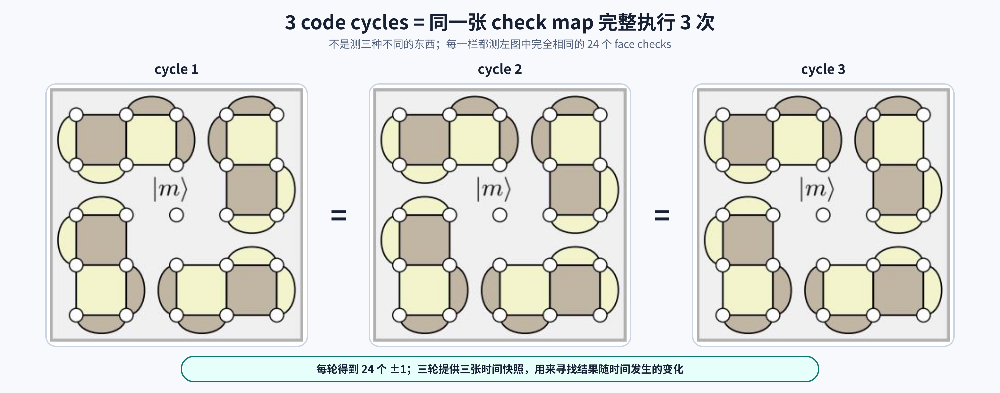

# 补充：state injection 的最小理解

这份补充解释论文 arbitrary-state initialization 背后的 Fig. 38。它用于保存容易混淆但值得记录的内容，不是阶段 3 的主线考点。

当前只需要达到下面的理解：

```text
noisy physical magic state |m⟩
        +
已准备好的 helper state
        ↓ 更换并测量 joint checks
noisy logical magic state |m⟩ₗ
```

Stabilizer generator replacement、exact circuit 和 decoder 细节留到阶段 4、5。

## 1. Injection 不是创造 magic

论文后续用 surface code 实现通用计算时，需要一种供算法消耗的特殊状态（resource state），记作 magic state `|m⟩`。底层硬件先在一个 physical qubit 上不可靠地制备它。

State injection 的任务不是从普通状态创造 magic，而是完成：

```text
physical |m⟩ → logical |m⟩ₗ
```

也就是把一份只由单个 physical qubit 携带、尚未受到 code distance 保护的信息，编码成整个 patch 携带的 logical information。

Fig. 38 没有给出制备 physical `|m⟩` 的 pulse 或 gate circuit。它把这份 noisy physical state 当作输入。

## 2. 先看论文原图



读图时只抓住四步：

```text
1. 中央 physical qubit 保存 |m⟩
2. 左图的 checks 连续测 3 轮，准备周围 helper state
3. 更换 check schedule，把中央 m 接入关系网
4. 右图的 checks 连续测 3 轮，形成并解码完整 patch
```

图中箭头不表示 physical qubits 移动。它只表示从下一轮开始更换 measurement schedule。

## 3. 左边 3 轮：准备 helper state

左图包含：

- 中央 1 个 isolated physical magic-state qubit；
- 周围 24 个 physical data qubits；
- 每轮 24 个 face checks。

中央白点没有被任何彩色 face 接触，所以左边 checks 不包含 `m`。它仍然独自保存要注入的 quantum information。

周围四个六-qubit islands 不是四个 logical qubits。左图的 X/Z product checks 把它们准备成一个已知的联合辅助状态；论文把它称为 stabilizer state。它不保存未知 logical content。

“3 code cycles”表示把同一张 check map 完整执行三次：



理想、无噪声时，一轮完整 measurement 就能建立关系。现实中 measurement 本身可能出错，所以三轮提供短暂的时间记录。Decoder 会结合时间和空间上的变化，不是对每个结果机械地做三次多数投票。

## 4. Helper state 为什么不能随便准备

最小例子只使用一个 input qubit `m` 和一个 helper `a`。先用熟悉的 input `|+⟩` 测试。

如果 helper 也是 `|+⟩`，测量 `Z_m⊗Z_a` 后：

```text
结果 +1：(|00⟩+|11⟩)/√2

结果 -1：(|01⟩+|10⟩)/√2
```

Input 原来同时保留的两个 branches 仍然共同存在，只是现在由两个 qubits 的联合关系保存。

如果 helper 错误地使用 `|0⟩`：

```text
测量前：(|00⟩+|10⟩)/√2

Z_m⊗Z_a = +1 → |00⟩
Z_m⊗Z_a = -1 → |10⟩
```

Measurement 把 input 读成一个确定的 Z branch，原来的 `|+⟩` 不再保留。任意 state 和 magic state 面临的是同一个问题：helper 不正确时，measurement 可能读出或扭曲本应编码的内容。

因此，Fig. 38 左侧 helper state 不是“随便放一批 qubits，再把右图 checks 打开”。它是这份 encoding protocol 所需的特定辅助输入。

`|+⟩` 也不能理解成“随机但已经确定的 `|0⟩` 或 `|1⟩`”。抛硬币准备 `|0⟩/|1⟩` 虽然具有相同的 Z measurement 概率，却是 classical mixture，不能代替能够同时保留两个 branches 的 quantum superposition。

## 5. Check switch：真正执行 encoding

切换时，共有的 checks 继续测量；朝向内部空隙的旧 checks 停止；跨越旧空隙并围绕中央 `m` 的新 checks 开始测量。Physical qubits 没有移动，改变的是 measurement schedule。

四个中央 checks 中有两个 X type、两个 Z type。它们问的是：

```text
中央 Pauli × 三个邻居 Pauli
```

没有任何一个 check 单独读取 `X_m` 或 `Z_m`。新的 joint measurements 在 `m` 与 helper state 之间建立关系，使原来集中在 physical `m` 上的 X/Z information 延伸为整个 patch 的 logical X/Z information。

切换完成后：

```text
切换前：唯一未知的信息集中在 physical m
切换后：完整 patch 保存唯一一个 logical qubit
```

在理想、没有额外 fault 的情况下，最终 logical qubit 保存输入 `m` 实际携带的状态，至多差一个由 measurement outcomes 决定的已知 Pauli frame。实际协议还可能带有未检测的 logical Pauli error。

## 6. 右边 3 轮：建立完整 patch 的时间记录

右图每轮仍然测 24 个 checks：

```text
16 个四体方形 checks
+ 8 个外侧二体半圆 checks
```

在理想模型中，第一次执行新 checks 时 encoding 已经发生。连续三轮的意义是为 noisy check measurements 提供一段 syndrome history，让 decoder 处理一部分 switch 附近的 data/measurement faults。

原始 injection 方案把六轮概括为：

```text
前 3 轮：prepare ancillary/helper state
后 3 轮：decode the full code
```

它们不是六次 logical magic-state measurement，也不会移除最终 data patch。

## 7. 必须纠正：Pauli operation 不等于 Pauli measurement

Pauli X operation 会执行：

```text
|0⟩ ↔ |1⟩
```

X measurement 不会“施加一次 X flip”。它返回 `+1/-1`，并让 qubit 进入相应的 X state：

```text
X measurement = +1 → |+⟩
X measurement = -1 → |−⟩
```

例如 Bell state：

```text
(|00⟩ + |11⟩)/√2
=
(|++⟩ + |--⟩)/√2
```

如果只对第二个 qubit 做 X measurement 并得到 `+1`，状态变成：

```text
|++⟩
```

不是 `|00⟩`。此时再测 `Z₁⊗Z₂`，结果为 `+1/-1` 各 50%，原先确定的 Z-product relationship 已经不再确定。

所以正确说法是：

> 一个 X measurement 可能使不兼容的旧 Z relationship 失去确定性；这不表示 measurement 对 data qubit 执行了 X operation。

旧/new check 的精确数量、旧 results 怎样合成为新 bridge result，以及 operation/measurement compatibility 的完整例子，已经保存在 [延后参考：Fig. 38 check switch](state-injection-check-switch-reference.md)。它属于阶段 4、5 的阅读材料，本阶段不要求继续推导。

## 8. 为什么固定 3+3 轮却记作 0 time step

这份协议总共确实需要六轮 physical check measurements，并非字面上的零时间。

但是轮数固定为 `3+3`，不随 code distance `d` 增长。更重要的是，这个 injection gadget 中存在只需一个 physical fault 就可能破坏 logical output 的位置；它不只是在最终 patch 建立之后留下一个普通、可检测的单点错误。

输入 `m` 在编码前出错是最直接的例子：

```text
实际输入 P|m⟩
    ↓ encoding
输出 logical P_L|m⟩ₗ
```

Helper preparation 或 check-switch circuit 中也可能存在单 fault 到 logical error 的路径；Fig. 38 没有画出足以逐项分析这些路径的 gate schedule。普通 checks 只能判断 patch relationships 是否合法，不知道操作者原本想输入哪个 magic state。因此，把后续 checks 增加到 `d` 轮也不能自动恢复已经编码进去的错误输入。

所以：

- 时间成本是常数，tile game 记作 `0 time step`；
- 输出错误率仍与 physical error rate 同阶；
- state injection 是 non-fault-tolerant；
- 后续需要 magic-state distillation 提高正确率（fidelity）。

论文原文可参阅 [Litinski Appendix A / Fig. 38](../../arxiv/A_Game_of_surface_code-1808.02892v3.md)。

## 9. 当前应该记住什么

只需要能够复述：

> Hardware 先准备 noisy physical `|m⟩`。左图用固定三轮准备周围 helper state，中央 `m` 不参与。随后更换 check schedule，新 joint checks 把 `m` 纳入完整 patch；右图再测固定三轮形成短 syndrome history。最终得到 noisy logical `|m⟩ₗ`。整个过程是 encoding，不是对 `m` 的单独验证，也不是 magic-state distillation。

现在不需要继续推导每一个 face operator。阶段 4 会重新从 physical data/measurement qubits 和 stabilizer circuit 开始，以统一方式解释这些 checks。
