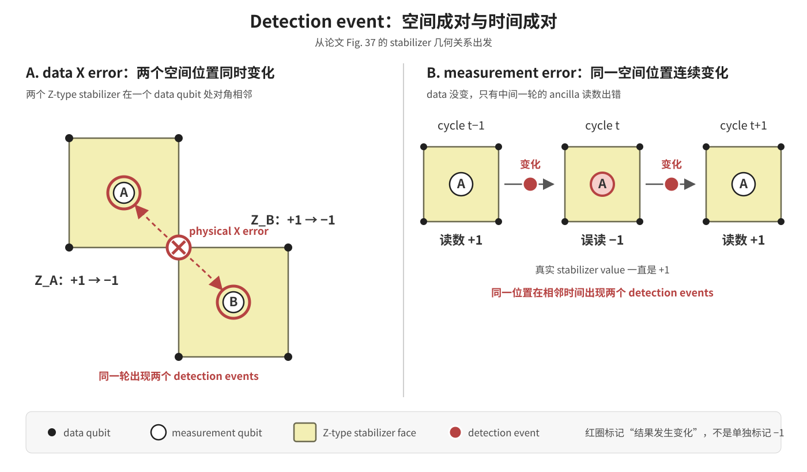
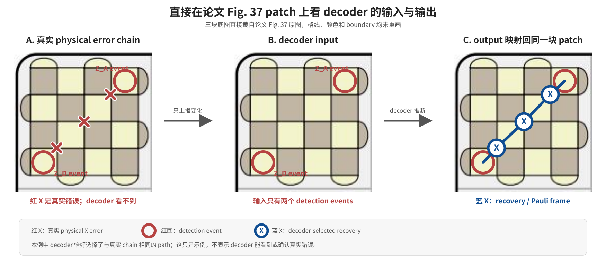
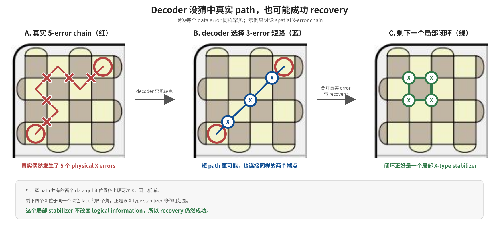
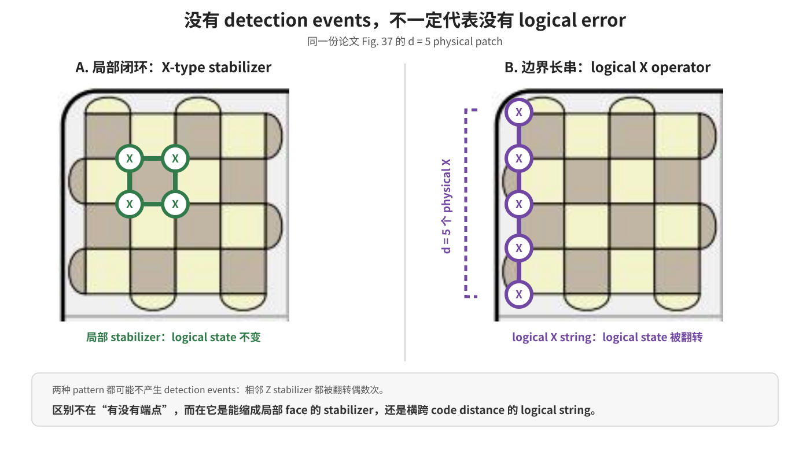
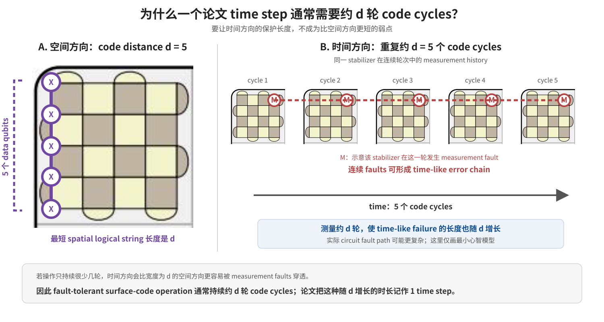

# 阶段 4：掀开棋盘看真实 surface code

## 本阶段要解决的问题

阶段 3 把一个 logical qubit 当作棋盘上的 patch，用 tile 和 time step 计算主要成本。这个抽象适合描述协议，但隐藏了真正执行纠错的对象。

阶段 4 掀开这层抽象，回答下面的问题：

1. 一个 patch 下面有哪些 physical qubits，它们分别做什么？
2. X/Z stabilizer 怎样被 measurement ancilla 反复测量？
3. Physical error 怎样留下 syndrome history 和 detection events？
4. Decoder 看见什么、推断什么，以及 recovery 为什么不必复原真实错误？
5. 为什么局部 error loop 可以无害，而 boundary string 会成为 logical error？
6. 为什么论文中的一个 time step 通常需要约 `d` 轮 code cycles？

论文锚点是 Appendix A，主要对照 Fig. 37 和 Fig. 39。

读完后，应该能够从一个 physical error 出发，完整复述：

```text
physical error
→ stabilizer result 发生变化
→ syndrome history 留下 detection events
→ decoder 选择 recovery
→ physical correction 或 Pauli frame
→ logical information 保持不变，或者发生 logical error
```

## 1. 一个 tile 下面有什么

### Data qubit 保存编码信息

论文 Fig. 37 展示了 `d = 5` 时的 surface-code patches：


图中的网格顶点放置 **physical data qubit**。

一个 tile 对应大约：

```text
d² 个 physical data qubits
```

因此，`d = 5` 的一个 tile 有：

```text
5 × 5 = 25 个 data qubits
```

Logical information 不是被切成 25 份，分别存进这些 qubits。它存在于整组 data qubits 共同满足的编码关系中。

### Measurement qubit 反复读取关系

Surface code 不能逐个测量 data qubit 来找错。逐个读取会得到过多信息，并改变或消耗 logical state。

因此，硬件还需要 **measurement qubit**，也叫 **syndrome ancilla**：

1. 准备或重置 measurement qubit。
2. 让它和附近的 data qubits 依次相互作用。
3. 只测量 measurement qubit。
4. 得到一条联合关系的 `+1/-1`。
5. 下一轮重置后继续使用。

论文 Fig. 39 用黑白点区分了两种 qubit：


所以，论文说一个 tile 有 `d²` 个 physical data qubits，不代表硬件总共只有 `d²` 个 physical qubits。加上 measurement qubits 后，普通 patch 的总数通常接近翻倍；边界和特殊 checks 会让精确数量有所不同。

还要区分两个名字相近但层级不同的对象：

- **Measurement ancilla qubit**：一个底层 physical helper qubit。
- **Ancilla patch**：阶段 3 中用于 lattice surgery 的整个 logical patch，由许多 data 和 measurement qubits 组成。

## 2. X-type 与 Z-type stabilizer

### Face 表示检查关系

Fig. 37 中：

- 浅色 face 表示 Z-type stabilizer。
- 深色 face 表示 X-type stabilizer。
- Face 的角上是参与检查的 data qubits。

一个内部浅色 face 可以写成：

```text
S_Z = Z₁ Z₂ Z₃ Z₄
```

一个内部深色 face 可以写成：

```text
S_X = X₁ X₂ X₃ X₄
```

靠近 boundary 的 stabilizer 可能只包含两个 data qubits，但工作方式相同。

这里必须分开：

- `S_X` 或 `S_Z` 是 stabilizer operator，也就是被检查的关系。
- `+1/-1` 是某一轮 stabilizer measurement 得到的 result。
- Face 是这条关系的几何标记，不是一个额外的“大 qubit”。

### 哪种 error 被哪种 check 发现

最容易记反的对应关系是：

```text
physical X error
→ 改变 Z-type stabilizer result

physical Z error
→ 改变 X-type stabilizer result
```

原因可以从具体 basis 看：

```text
X error 会交换 |0⟩ 和 |1⟩
→ 改变共同 Z 关系

Z error 会交换 |+⟩ 和 |−⟩
→ 改变共同 X 关系
```

因此可以简记为：

```text
X error → Z check
Z error → X check
```

## 3. Stabilizer measurement circuit

### 测量 Z-type stabilizer

为了测量：

```text
Z₁ Z₂ Z₃ Z₄
```

可以执行：

1. 把 ancilla 准备为 `|0⟩`。
2. 依次执行 `CNOT(dataᵢ → ancilla)`。
3. 在 Z basis 测量 ancilla。

为了核对 circuit，可以暂时假设 data qubits 有确定的 Z-basis answers：

```text
偶数个 1
→ ancilla 最后测得 0
→ stabilizer result = +1

奇数个 1
→ ancilla 最后测得 1
→ stabilizer result = -1
```

真实 surface-code state 并不是“每个 data qubit 暗中已经选好了 0 或 1”。这个例子只用来核对 CNOT 的动作。Circuit 真正测量的是联合 operator，而不暴露每个 data qubit 的单独答案。

### 测量 X-type stabilizer

为了测量：

```text
X₁ X₂ X₃ X₄
```

可以执行：

1. 把 ancilla 准备为 `|+⟩`。
2. 依次执行 `CNOT(ancilla → dataᵢ)`。
3. 在 X basis 测量 ancilla。

为了核对动作，可以暂时假设 data qubits 有确定的 X-basis answers：

```text
偶数个 |−⟩
→ ancilla 最后为 |+⟩
→ stabilizer result = +1

奇数个 |−⟩
→ ancilla 最后为 |−⟩
→ stabilizer result = -1
```

两类 circuit 的 CNOT 方向不同：

```text
Z-type check：
data 是 control，ancilla 是 target

X-type check：
ancilla 是 control，data 是 target
```

## 4. Code cycle 与 syndrome history

### 一个 code cycle 测量全部 checks 一轮

把当前 patch 中所有 X-type 和 Z-type stabilizers 各测量一遍，叫作一个 **code cycle**。

一次 code cycle 大致包含：

```text
准备或重置所有 measurement qubits
→ 按 schedule 执行若干层 CNOT
→ 测量所有 measurement qubits
→ 每条 stabilizer 得到一个 result
```

一个 data qubit 通常同时属于附近多条 stabilizers，不能在同一瞬间与多个 ancillas 做 gate。因此，硬件需要把 CNOT 排成若干小层。这些小层合起来才是一个 code cycle。

需要区分：

```text
一次 gate
< 一次 code cycle
< 论文中的一个 time step
```

### Syndrome snapshot 与 history

一次 code cycle 得到的整组 stabilizer results，可以看作一张 **syndrome snapshot**。

连续执行 code cycles，就得到 **syndrome history**：

```text
cycle 1 的全部 results
cycle 2 的全部 results
cycle 3 的全部 results
...
```

本笔记采用下面的词义：

- Syndrome snapshot：一轮 raw stabilizer results。
- Syndrome history：多轮 results 组成的时间记录。
- Detection event：相邻可比较轮次之间，result 发生了变化。

不同论文和软件有时会把 syndrome 一词用于 raw results 或 changes。科研沟通时需要确认对方采用哪种含义。

## 5. Detection event 是“变化”，不是 `-1`

只看一条 stabilizer：

```text
cycle：    1    2    3    4    5
result：  +1   +1   -1   -1   -1
```

这里只有 cycle 2 到 cycle 3 之间出现 detection event：

```text
+1 → -1
```

Cycle 4 和 cycle 5 虽然仍然是 `-1`，但没有发生新变化，因此没有新的 detection event。

必须记住：

```text
-1 本身
≠ detection event

相邻轮次 result 不同
= detection event
```

在初始化、最终 data measurement 和 check configuration 切换时，第一轮或最后一轮需要与相应的时间 boundary 比较。当前最小模型先使用普通静态 patch 的相邻轮次比较。

## 6. Data error 与 measurement error 的时空形状



### Data error 通常在空间方向留下端点

Patch 内部的一个 data qubit 通常被两个同类型 stabilizers 共享。

一个 physical X error 会让两个相邻 Z checks 在同一轮发生变化：

```text
时间相同
空间位置相邻
→ 更像 data X error
```

Boundary 附近可能只出现一个普通 check event，因为 error chain 的另一端可以落在允许的 boundary。Boundary 的作用在后文解释。

### Measurement error 通常在时间方向留下端点

如果 data 没变，但某一轮 measurement 被错读：

```text
真实 result：+1  +1  +1  +1
实际读数：  +1  +1  -1  +1
```

会出现两个 detection events：

```text
+1 → -1
-1 → +1
```

它们位于同一 stabilizer 的相邻时间位置：

```text
空间位置相同
时间位置相邻
→ 更像 measurement error
```

这只是最简单的候选解释，不是证明。不同 fault combinations 可能留下相同 events，decoder 必须结合 noise model 推断。

### Event 数量不等于 chain length

一次 measurement fault 可以产生两个 detection events，但 chain length 是 `1`。

连续三轮 measurement faults 仍然可能只有两个端点，但 chain length 是 `3`：

```text
result：+1  +1  -1  -1  -1  +1

events：
cycle 2 → 3
cycle 5 → 6
```

所以：

```text
detection events
= error chain 的端点

chain length
= 中间包含的 fault edges 数量
```

## 7. Error chain 与 decoder

### 中间 effects 可以抵消，errors 本身没有消失

考虑三个相邻 data qubits 上的 X errors：

```text
Z_A ─ q₁ ─ Z_B ─ q₂ ─ Z_C ─ q₃ ─ Z_D
      X error       X error       X error
```

每条 Z check 被翻转的次数是：

```text
Z_A：1 次 → 有 event
Z_B：2 次 → result 不变
Z_C：2 次 → result 不变
Z_D：1 次 → 有 event
```

因此 decoder 只看到 `Z_A` 和 `Z_D` 两个端点。

这里不能说“中间的 physical errors 抵消了”。三个 errors 位于不同 data qubits，仍然都存在。真正抵消的是：

> 相邻 errors 对中间 stabilizer result 的两次翻转效果。

### Decoder 只看见端点

下面的教学图直接使用论文 Fig. 37 的 `d = 5` patch：



图中：

- 红 X 是真实 physical errors，decoder 看不见。
- 红圈表示 detection events 的空间坐标。
- 蓝 X 是 decoder 选择的 recovery。

红圈画在 face 中心，表示“这条 stabilizer 在相邻轮次之间发生变化”。红圈不是 measurement qubit，也不是说 face 本身发生了错误。

Decoder 接收的对象类似：

```text
event(Z_A, cycle t)
event(Z_D, cycle t)
```

它不会收到：

```text
q₁、q₂、q₃ 发生了 X error
```

Decoder 使用一个经典 **decoding graph**：

- Graph node 表示可能出现 detection event 的时空位置。
- Spatial edge 表示一种可能的 data fault。
- Temporal edge 表示一种可能的 measurement fault。
- Edge weight 表示这类 fault 有多不可能。

Decoder 寻找能解释所有 observed events 的低权重 paths。它输出的是最可能的 recovery，不是被证明过的历史真相。

### Decoder output 怎样回到 patch

一条连接相邻 Z-check nodes 的 spatial edge，可以映射到它们共享的 data qubit。

Decoder 可以：

1. 实际对选中的 data qubits 施加 physical X correction。
2. 不发送 gate，只把 recovery 记录进 Pauli frame。

如果实际发送 correction，真实 error `E` 和 recovery `R` 都在芯片上执行。先发生 `E`，再执行 `R`，净作用是：

```text
R · E
```

如果使用 Pauli frame，只有 `E` 物理发生；`R` 是经典控制系统采用的虚拟 correction。后续 measurement interpretation 按照仿佛执行过 `R` 的方式处理。

Temporal edge 则表示 measurement record 的 fault，没有对应的 data-qubit X correction。这也是为什么静态二维 patch 图不能完全代替包含时间方向的 decoding graph。

## 8. Recovery 不必猜中真实 path



图中的例子假设每个 data error 同样罕见：

- 真实世界偶然发生了一条 5-error 红色绕路。
- Decoder 只看见两个端点，选择更可能的 3-error 蓝色短路。
- Decoder 没有猜中真实 path。

把真实 error 和 recovery 合并：

1. 红、蓝 paths 共享的两个 data-qubit 位置各出现两次 X，因此抵消。
2. 剩下四个 X 位于同一个深色 face 的四个角。
3. 这四个 X 正好组成该 face 的 X-type stabilizer。

可以写成：

```text
R · E = S_X
```

其中：

- `E` 是真实 error operator。
- `R` 是 decoder recovery operator。
- `S_X` 是一个局部 X-type stabilizer。

合法 code state 满足：

```text
S_X 作用于合法 state
→ logical information 不变
```

因此，decoder 虽然猜错 physical path，recovery 仍然成功。

### “Face 已经有 stabilizer”是什么意思

深色 face “有 `S_X`”不表示芯片上一直执行着一个 `S_X` gate。

准确含义是：

> 这个 face 定义了 `S_X = X₁X₂X₃X₄` 这条不变关系。

Stabilizer measurement 通过 ancilla 读取这条关系的 `+1/-1`，也不是每轮都把 `S_X` gate 施加到 data qubits。

如果 physical correction 使净作用 `R·E` 恰好等于 `S_X`，那么 `S_X` 确实作为净 operator 作用于 state；但合法 encoded state 在这个 operator 下保持不变。

一个 operation 可以真实执行，但状态不变。例如：

```text
在 |+⟩ 上执行 X
→ X 确实执行
→ state 仍然是 |+⟩
```

## 9. Local stabilizer 与 logical error



左右两种 X patterns 都可能不产生 detection events，但逻辑效果不同。

### 局部闭环是 stabilizer

左图的四个 X 围住一个深色 face：

```text
X₁X₂X₃X₄ = 该 face 的 X-type stabilizer
```

它可以被局部 stabilizer relation 消去，不改变 logical information。

### Boundary 长串是 logical operator

论文 Fig. 1a 中，左右虚线边表示 logical X boundary。沿一条 X boundary 的 `d` 个 physical X，联合起来是 logical X operator。

对于图中的 `d = 5` patch：

```text
5 个 physical X
→ 每条现有 Z check 都被翻转偶数次
→ 没有 detection events
→ 但联合效果是 logical X
```

它会翻转 logical information，例如：

```text
logical |0⟩ ↔ logical |1⟩
```

这就是 logical error：

> 所有局部 checks 都可能正常，但 physical-error pattern 联合起来执行了非平凡 logical operator。

所以：

```text
没有 detection events
≠ 一定安全
```

Decoder 成功的条件不是“猜中所有 physical errors”，而是：

```text
R · E
属于 stabilizer group
→ logical recovery 成功

R · E
等价于非平凡 logical operator
→ logical error
```

这里有一个隐含前提：`E` 和 `R` 必须解释同一组 detection events，所以 `R·E` 不再留下 syndrome。在这个前提下，剩余作用要么可以由一个或多个 local stabilizers 组成，要么还包含非平凡 logical operator。不能脱离这个前提，把“不是 stabilizer”直接等同于 logical error。

## 10. Code distance 的几何意义

Code distance `d` 是形成最短非平凡 logical Pauli operator 所需的 physical Pauli 数量。

在上面的 `d = 5` patch 中，最短 logical X boundary string 包含 5 个 physical X：

```text
最短 logical string length = 5
→ code distance = 5
```

Distance 描述的是 logical operator 的最小 physical weight，不是 detection-event 数量。

在理想化的独立、同概率 Pauli-error 模型中，decoder 通常优先选择较短的 candidate path。真实硬件中的 gate、idle、reset 和 measurement error rates 可能不同，所以 decoder 使用 edge weights，而不是只数几何长度。

## 11. 为什么一个 time step 需要约 d 轮 cycles



### 空间方向有长度 d

一个 distance-`d` patch 的最短 spatial logical string 长度是 `d`。

### 时间方向也可能出现 error chain

Measurement 本身会出错。如果一个新 stabilizer configuration 或 lattice-surgery measurement 只执行一轮，时间方向的保护长度可能接近 `1`：

```text
空间方向保护长度 = d
时间方向保护长度 = 1
```

这会让 measurement 成为整个操作的弱点。

连续测量约 `d` 轮，会建立 syndrome history。单次 measurement fault 通常留下相邻时间位置的一对 events；要沿时间方向骗过整个 operation，faults 需要形成更长的 time-like chain。

目标是让：

```text
空间方向保护长度 ≈ d
时间方向保护长度 ≈ d
```

因此，论文把持续时间随 `d` 增长、通常约为 `d` 轮 code cycles 的容错操作抽象成：

```text
1 time step
```

这不是严格恒等式：

```text
1 time step
≠ 永远精确等于 d 个 code cycles
```

更准确地说，time step 表示这项主要时间成本随 code distance 线性增长。具体轮数取决于 protocol、schedule、边界条件和 fault-tolerance convention。

## 12. 把阶段 3 的棋盘对象映射到底层

### Tile

```text
棋盘：空间计价单位
底层：大约 d² 个 physical data qubits，加上 measurement qubits
```

### Patch

```text
棋盘：保存 logical qubit 的连续区域
底层：一组 data qubits、measurement qubits 和反复执行的 stabilizer checks
```

### Edge

```text
棋盘：logical X/Z operator 的可用 boundary
底层：长度约为 d 的 physical Pauli string
```

### Time step

```text
棋盘：随 d 增长的主要时间单位
底层：通常约 d 轮 code cycles
```

这四层映射把阶段 3 的 tile game 和真实 QEC 闭环连接起来。

## 13. 必须分清的概念

### Ancilla qubit 不等于 ancilla patch

前者是一个 physical measurement helper；后者是一个完整 logical patch。

### Stabilizer 不等于 measurement result

Stabilizer 是被检查的 operator relation；`+1/-1` 是某轮 result。

### X-type stabilizer 不等于逐个 X measurement

Ancilla circuit 只读取联合 X relation，不暴露每个 data qubit 的单独 X answer。

### X error 被 Z check 发现

X error 改变共同 Z relation；Z error 改变共同 X relation。

### `-1` 不等于 detection event

Detection event 是相邻可比较 results 之间发生变化。

### 两个 events 不代表 chain length 是 2

两个 events 通常是 chain 的端点；chain length 是中间 fault edges 的数量。

### “中间影响抵消”不等于 errors 消失

不同 data qubits 上的 errors 仍然存在，只是它们对中间 stabilizer result 的两次翻转效果抵消。

### Stabilizer relation 已定义，不等于 stabilizer gate 已执行

Face 定义一条不变关系。只有 actual operations 的净 operator 等于该 stabilizer 时，才能说这个 stabilizer 作为净作用被执行。

### Physical correction 不等于 Pauli frame

Physical correction 真实发送 gate；Pauli frame 只在经典软件中记录 recovery，并调整后续结果解释。

## 阶段结论

可以用下面这段话概括阶段 4：

> 一个 surface-code patch 由 physical data qubits 和 measurement qubits 组成。Measurement ancillas 在每个 code cycle 中反复读取浅色 Z-type 与深色 X-type stabilizers，但不直接读取 logical information。连续 results 形成 syndrome history，相邻轮次的变化形成 detection events。Data faults 通常在空间方向留下端点，measurement faults 通常在时间方向留下端点；decoder 在经典 decoding graph 上寻找最可能的 recovery path，而不是复原真实错误。Recovery 与真实 error 可以相差一个 local stabilizer 而仍然成功；如果它们的组合形成 boundary-to-boundary logical string，就会发生 logical error。为了让时间方向的 fault path 不比空间 distance 更短，容错操作通常持续约 `d` 轮 code cycles，论文把这种随 `d` 增长的时长记作一个 time step。

## 验收记录

本阶段已经能够独立说明：

- Data qubit 与 measurement/ancilla qubit 的不同职责。
- 一个 tile 的 `d²` 只计算 physical data qubits，不是全部硬件 qubits。
- X/Z stabilizer 与 stabilizer measurement result 的区别。
- 为什么 X error 改变 Z-type checks，Z error 改变 X-type checks。
- 一个 Z-type 和 X-type stabilizer measurement circuit 的操作顺序。
- 一个 code cycle 是全部 checks 各测量一轮。
- Detection event 是轮次间的变化，而不是某轮为 `-1`。
- Data error 与 measurement error 在 syndrome history 中的空间、时间形状。
- Error-chain endpoints 与 chain length 的区别。
- Decoder 为什么只看到 endpoints，而且 recovery 不必复原真实 path。
- Physical correction 与 Pauli frame 的区别。
- Recovery 与真实 error 相差 local stabilizer 时为什么仍然成功。
- 没有 detection events 的 boundary string 为什么仍可能是 logical error。
- `d = 5` 的 physical logical string 与 code distance 的关系。
- 为什么一个 fault-tolerant operation 通常需要约 `d` 轮 code cycles。

## 自测问题

1. 为什么不能逐个测量 data qubits 来检查错误？
2. `d = 5` 的一个 tile 有 25 个 data qubits，为什么不能说硬件总共只有 25 个 physical qubits？
3. X-type stabilizer 是四次单独 X measurement 吗？
4. 为什么 physical X error 改变的是 Z-type stabilizer result？
5. 一个 code cycle 与一个 time step 有什么区别？
6. Stabilizer history 为 `+1、+1、-1、-1、+1` 时，哪些轮次之间有 detection events？
7. 为什么一次 measurement fault 可以产生两个 events，但 chain length 是 1？
8. 三个相邻 physical X errors 为什么通常只露出 error chain 的两个端点？
9. Decoder 选择的 recovery 与真实 path 不同，为什么仍可能成功？
10. “深色 face 已经有 `S_X`”为什么不表示芯片上已经执行了一次 `S_X` gate？
11. Local stabilizer loop 和 logical boundary string 都没有 events，为什么只有后者是 logical error？
12. 为什么 distance-`d` operation 通常要持续约 `d` 轮 code cycles？

## 下一阶段

阶段 5 将学习 lattice surgery。

届时会从两个视角解释同一件事：

- 棋盘之上：patch merge、split 和 logical `Z⊗Z` / `X⊗X` measurement。
- 棋盘之下：哪些 stabilizers 被移除、加入或重解释，以及它们的 measurement products 为什么等于目标 logical Pauli product。

阶段 4 建立的 data/measurement qubits、code cycles、syndrome history、decoder、boundary 和 logical string，是理解 lattice surgery 的底层工具。
